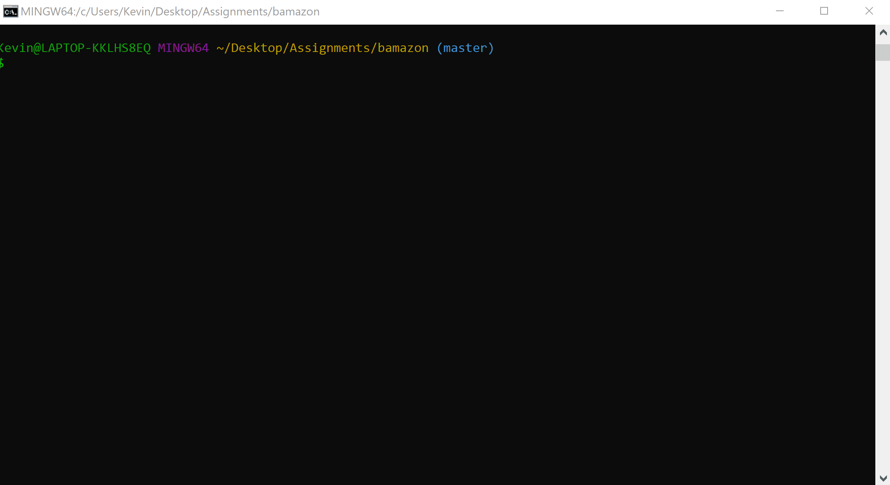

# Bamazon
This application is a simple application that takes orders for products and updates a database to reflect any stock changes.

# Code Organization
Application organization is straightforward. The function Init starts the entire application. A loop is used to go through all the items in the database and to display for the user. Inquirer is used to ask the user what they want to buy and how many. If the database has enough in stock, the database is updated and the customer is notified of their total price. If there is not enough in stock, customer is notified "Insufficient Quantity" and the application will end.

# Prerequisite Node Packages:
mysql
inquirer

# Setup Instructions:
1. Download all files from [GitHub Repo](https://github.com/KevinJoun/bamazon)
2. Install all node packages.
3. Setup the database by running the query.sql file.
4. Update the SQL server connection information in the bamazonCustomer.js file.

# App Instructions:
The application will start by listing all the items that are available. This list will also have the item id, cost, department name, and stock quantity. The application will then prompt the user what they would like to buy. Please enter a item id from the previous list.
The application will prompt for how many of the item they would like.
If there is enough in stock, it will let you know and show the total cost.
IF there is not enough in stock, it will let you know "Insufficient Quantity" and end the application.

